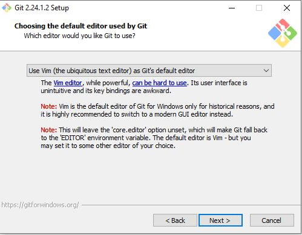

# Download resource
* download link https://git-scm.com/download/win

## the source file
download git2.24.1.2:

## Windows 10 OS install git2.24.1.2
1. double click the installation file and click `Next` `git2.24.1.2-64-bit.ext`, the GUI is as following:

2. if you do not want to install `Git GUI`, then cancel the red box and click `Next`:

3. click `Next`

4. click `Next`

5. click `Next`

6. click `Next`, make sure choose `Checkout Windows-style, commit Unix-style line endings`, if not, it might occur compatibility issue.

7. click `Next`

8. click `Next`

9. click `Next`

10. click `Next`

